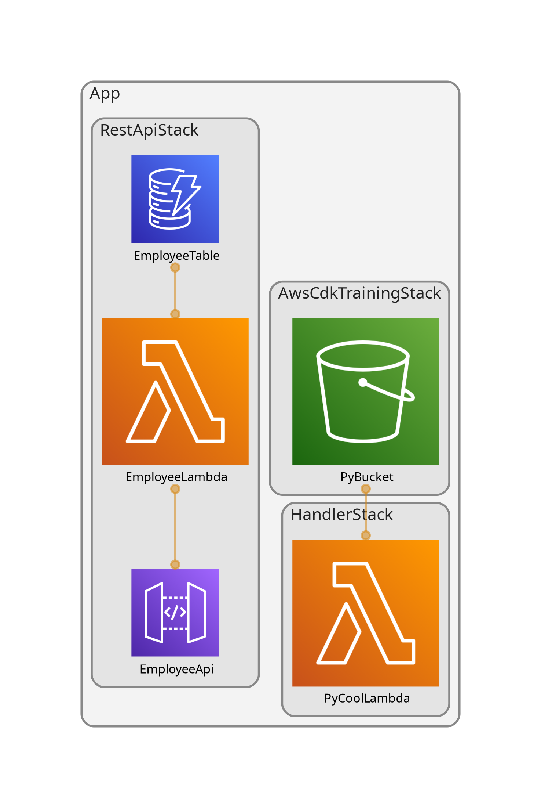

# AWS CDK Training — Python

AWS CDK project with Python that deploys stacks on AWS. Built for learning and experimentation purposes.

---

## Architecture



---

## Stacks

### 1. `AwsCdkTrainingStack`
**File:** `aws_cdk_training/aws_cdk_training_stack.py`

Creates an S3 bucket with a lifecycle rule.

| Resource | Details |
|---|---|
| **S3 Bucket** | Name: `py-bucket-{suffix}` (suffix derived from stack ID) |
| **Lifecycle rule** | Objects expire automatically after **3 days** |

Exposes a `bucket` property used by `HandlerStack` as a cross-stack reference.

---

### 2. `HandlerStack`
**File:** `aws_cdk_training/handler_stack.py`

Creates a Lambda function that reads the ARN of the S3 bucket from `AwsCdkTrainingStack`.

| Resource | Details |
|---|---|
| **Lambda** | Name: `PyCoolLambda` · Runtime: Python 3.11 |
| **Code** | Inline — prints `COOL_BUCKET_ARN` env var |
| **Cross-stack ref** | Receives `bucket` as constructor parameter from `AwsCdkTrainingStack` |

---

### 3. `RestApiStack`
**File:** `aws_cdk_training/rest_api_stack.py`

Creates a REST API backed by Lambda and DynamoDB.

| Resource | Details |
|---|---|
| **API Gateway** | REST API · Endpoint: `/prod/employee` |
| **Methods** | `GET /employee?id={uuid}` · `POST /employee` (JSON body) |
| **Lambda** | Name: `EmployeeLambda` · Runtime: Python 3.11 · Handler: `index.handler` |
| **DynamoDB** | `TableV2` · Partition key: `id` (String) · Billing: On-demand |
| **Removal policy** | `DESTROY` — table is deleted when the stack is destroyed |
| **CORS** | `Access-Control-Allow-Origin: *` · `Access-Control-Allow-Methods: *` |
| **IAM** | Lambda has `read/write` permissions on the table via `grant_read_write_data` |

#### Lambda handler responses

| Method | Condition | Status |
|---|---|---|
| `POST` | Valid body | `200` + `{ "id": "<uuid>" }` |
| `GET` | Employee found | `200` + employee JSON |
| `GET` | Employee not found | `404` |
| `GET` | Missing `id` param | `400` |
| Any | Unsupported method | `405` |

---

## Project Setup

### Prerequisites

- Python 3.x
- Node.js (for CDK CLI)
- AWS CLI configured (`aws configure`)
- CDK CLI: `npm install -g aws-cdk`
- Graphviz (for diagram generation): `sudo apt-get install graphviz`

### Installation

```bash
# Create and activate virtual environment
python3 -m venv .venv
source .venv/bin/activate        # Linux/macOS
# .venv\Scripts\activate.bat     # Windows

# Install dependencies
pip install -r requirements.txt
```

---

## Useful CDK Commands

### General

```bash
cdk ls                    # List all stacks in the app
cdk synth                 # Synthesize all stacks (generates CloudFormation templates)
cdk deploy                # Deploy ALL stacks
cdk diff                  # Compare all deployed stacks with current code
cdk destroy               # Destroy ALL stacks
cdk docs                  # Open CDK documentation
```

### Per stack

```bash
# Synthesize
cdk synth  AwsCdkTrainingStack
cdk synth  HandlerStack
cdk synth  RestApiStack

# Deploy
cdk deploy AwsCdkTrainingStack
cdk deploy HandlerStack
cdk deploy RestApiStack

# Deploy multiple stacks at once
cdk deploy AwsCdkTrainingStack HandlerStack

# See pending changes before deploying
cdk diff AwsCdkTrainingStack
cdk diff RestApiStack

# Destroy
cdk destroy AwsCdkTrainingStack
cdk destroy HandlerStack
cdk destroy RestApiStack
```

> **Note:** `HandlerStack` depends on `AwsCdkTrainingStack` (cross-stack reference).
> Deploy `AwsCdkTrainingStack` first, or use `cdk deploy --all` which resolves the order automatically.

### Diagram generation

```bash
# Regenerate architecture diagram after stack changes
npx cdk-dia

# Generate diagram for specific stacks only
npx cdk-dia --stacks RestApiStack AwsCdkTrainingStack HandlerStack
```

---

## Project Structure

```
app.py                          # CDK app entry point
cdk.json                        # CDK configuration
requirements.txt                # Python dependencies
diagram.png                     # Architecture diagram (auto-generated)
aws_cdk_training/
  aws_cdk_training_stack.py     # AwsCdkTrainingStack (S3)
  handler_stack.py              # HandlerStack (Lambda + S3 ref)
  rest_api_stack.py             # RestApiStack (API Gateway + Lambda + DynamoDB)
services/
  index.py                      # Lambda handler for RestApiStack
requests.http                   # HTTP test requests (REST Client)
```

